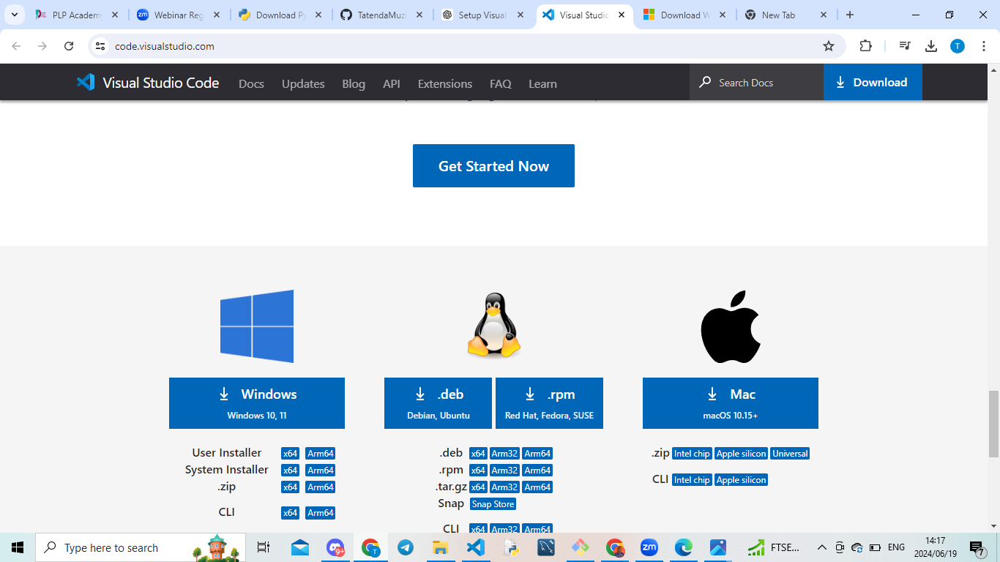

# Dev_Setup
Setup Development Environment

#Assignment: Setting Up Your Developer Environment

#Objective:
This assignment aims to familiarize you with the tools and configurations necessary to set up an efficient developer environment for software engineering projects. Completing this assignment will give you the skills required to set up a robust and productive workspace conducive to coding, debugging, version control, and collaboration.

#Tasks:

1. Select Your Operating System (OS):
   Choose an operating system that best suits your preferences and project requirements. Download and Install Windows 11. https://www.microsoft.com/software-download/windows11
   Chosen OS: Windows 11
Steps:
Visit Windows 11 download page .png>)
Download and install Windows 11 following on-screen instructions.

2. Install a Text Editor or Integrated Development Environment (IDE):
   Select and install a text editor or IDE suitable for your programming languages and workflow. Download and Install Visual Studio Code. https://code.visualstudio.com/Download

    Installing Visual Studio Code
Step 1: Download Visual Studio Code

Go to the Visual Studio Code website.

Click "Download for [your OS]" (e.g., Windows, macOS, Linux).
.png>)

Step 2: Install Visual Studio Code

Run the installer.

Follow the setup wizard and select the desired options.

Step 3: Launch Visual Studio Code

Open Visual Studio Code from the Start menu or application launcher.

3. Set Up Version Control System:
   Install Git and configure it on your local machine. Create a GitHub account for hosting your repositories. Initialize a Git repository for your project and make your first commit. https://github.com
   Installing GitHub
Step 1: Create a GitHub Account

Go to the GitHub website.

Click on "Sign up" and follow the instructions to create an account.

Step 2: Download and Install Git

Go to the Git website.

Click "Download" for your operating system..png>)

Run the downloaded installer and follow the setup wizard.

4. Install Necessary Programming Languages and Runtimes:
  Instal Python from http://wwww.python.org programming language required for your project and install their respective compilers, interpreters, or runtimes. Ensure you have the necessary tools to build and execute your code.

5. Install Package Managers:
   If applicable, install package managers like pip (Python).

   Installing Python and pip
Step 1: Download Python

Go to the Python Downloads page..png>)

Click "Download Python" for the latest version.

Step 2: Install Python

Run the installer..png>)

Ensure you check "Add Python to PATH" and click "Install Now".

Step 3: Verify pip Installation

Open Command Prompt or Terminal.

Type pip --version to ensure pip is installed correctly.

6. Configure a Database (MySQL):
   Download and install MySQL database. https://dev.mysql.com/downloads/windows/installer/5.7.html
   
Installing MySQL
Step 1: Download MySQL Installer

Go to the MySQL Downloads page.

Click "Download" for the MySQL Installer.
Step 2: Install MySQL.png>)
.png>)
Run the MySQL Installer.

Choose the setup type (e.g., Developer Default).

Follow the instructions to complete the installation.

7. Set Up Development Environments and Virtualization (Optional):
   Consider using virtualization tools like Docker or virtual machines to isolate project dependencies and ensure consistent environments across different machines.

8. Explore Extensions and Plugins:
   Explore available extensions, plugins, and add-ons for your chosen text editor or IDE to enhance functionality, such as syntax highlighting, linting, code formatting, and version control integration.
   . Explore Extensions and Plugins
Steps:
Open Visual Studio Code.
Go to Extensions (Ctrl+Shift+X).
Install useful extensions like:
Python
GitLens
Prettier - Code formatter
ESLint

9. Document Your Setup:
    Create a comprehensive document outlining the steps you've taken to set up your developer environment. Include any configurations, customizations, or troubleshooting steps encountered during the process. 

#Deliverables:
- Document detailing the setup process with step-by-step instructions and screenshots where necessary.
- A GitHub repository containing a sample project initialized with Git and any necessary configuration files (e.g., .gitignore).

- A reflection on the challenges faced during setup and strategies employed to overcome them.
. Challenges Faced
Dependency Conflicts:

Issue: Installing various Python packages via pip sometimes led to dependency conflicts, where one package required a different version of another package.
Solution: Using virtual environments to isolate dependencies for different projects.
MySQL Configuration:

Issue: Configuring MySQL, especially setting up the correct root password and user permissions, can be complex and prone to errors.
Solution: Following detailed setup guides and tutorials, and using MySQL Workbench for easier database management.
Path Environment Variable:

Issue: Forgetting to add Python and Git to the system PATH environment variable can lead to command not found errors.
Solution: Ensuring to check the "Add Python to PATH" option during installation and manually adding Git to the PATH.
Version Control Integration:

Issue: Integrating GitHub with Visual Studio and resolving issues with SSH keys or HTTPS credentials.
Solution: Carefully following the integration instructions and using GitHub’s SSH setup guide to configure SSH keys correctly.
Extension Compatibility:

Issue: Some extensions or plugins may not be compatible with the current version of Visual Studio or VS Code, leading to crashes or unexpected behavior.
Solution: Checking extension documentation for compatibility information and keeping the IDE and extensions up to date.
Network Issues:

Issue: Slow or unstable internet connections can interrupt the download and installation of software and packages.
Solution: Using reliable network connections when possible and downloading installers for offline use when necessary.

#Submission:
Submit your document and GitHub repository link through the designated platform or email to the instructor by the specified deadline.

#Evaluation Criteria:**
- Completeness and accuracy of setup documentation.
- Effectiveness of version control implementation.
- Appropriateness of tools selected for the project requirements.
- Clarity of reflection on challenges and solutions encountered.
- Adherence to submission guidelines and deadlines.

Note: Feel free to reach out for clarification or assistance with any aspect of the assignment.
